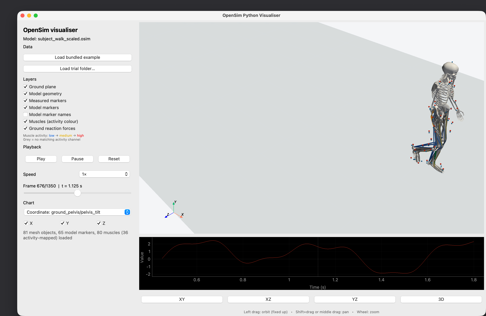

# OpenSimVisualiser

OpenSimVisualiser is a desktop Python application for exploring an OpenSim model together with motion-capture and trial data. It ships with OpenSim's `example3DWalking` data, so you can launch a working example immediately after installation.



## Features

- interactive 3D model geometry with standard camera controls;
- animated kinematics, model markers, and measured markers;
- ground-reaction force vectors and centres of pressure;
- muscle paths coloured by activation or EMG level;
- playback speed, frame scrubbing, layer controls, and time-series charts;
- a Python API for opening your own OpenSim trial.

## Requirements

- Python 3.10 or newer (Python 3.11 or newer for the OpenSim 4.6 PyPI package);
- the OpenSim Python API if you want model geometry, evaluated markers, and muscle paths.

The recommended Conda environment below installs OpenSim 4.5.2, matching the bundled example, from OpenSim's official `opensim-org` channel. OpenSim 4.6 and newer can also be installed from PyPI.

Without the OpenSim API, the package can still parse measured markers, kinematics, and ground-reaction forces, but it cannot evaluate the OpenSim model itself.

## Install

### Conda and Spyder (recommended)

Clone the repository and create the complete environment from `environment.yml`:

```bash
git clone https://github.com/SjoerdBruijn/OpenSimVisualiser.git
cd OpenSimVisualiser
conda env create --file environment.yml
conda activate opensim-visualiser
```

The environment includes OpenSim, Spyder, all visualization dependencies, and an editable installation of OpenSimVisualiser. Start Spyder from the activated environment so its console uses the correct interpreter:

```bash
spyder
```

You can use the Python API from Spyder or launch the bundled example from the same activated Conda environment:

```bash
opensim-visualiser
```

To refresh an existing environment after `environment.yml` changes:

```bash
conda env update --file environment.yml --prune
```

### `venv` and pip

With Python 3.11 or newer, you can install OpenSim 4.6 and OpenSimVisualiser from PyPI and the repository instead:

```bash
python -m venv .venv
source .venv/bin/activate
python -m pip install --upgrade pip
python -m pip install "opensim>=4.6"
python -m pip install .
```

On Windows, activate a `venv` with `.venv\Scripts\activate` instead. If you already have an environment in which `import opensim` works, activate it and run only `python -m pip install .` there.

Confirm that the bindings are available with:

```bash
python -c "import opensim; print(opensim.__version__)"
```

## Run the bundled example

After installation, either command opens the application with the included walking trial:

```bash
opensim-visualiser
# or
python -m OpenSimVisualiser
```

Use **Load trial folder…** in the application to select another trial. A folder must contain an `.osim` model; kinematics (`.sto` or `.mot`), markers (`.trc`), ground reactions (`.mot`), and activity/EMG (`.sto` or `.mot`) are optional.

## Python API

```python
from OpenSimVisualiser import OpenSimVisualiser

window = OpenSimVisualiser(
    model_path="path/to/model.osim",
    coordinate_path="path/to/coordinates.sto",  # optional
    marker_path="path/to/markers.trc",           # optional
    grf_path="path/to/forces.mot",               # optional
    activity_path="path/to/activations.sto",     # optional
)
```

Only `model_path` is required. When `coordinate_path` is omitted, the model is shown as a one-frame static pose using the coordinate defaults stored in the model.

## Development

The project uses a `src` layout, with the installable package in `src/OpenSimVisualiser` and tests in `tests`.

```bash
python -m pip install -e ".[dev]"
python -m pytest
python -m build
```

`requirements.txt` remains available as a convenience for editable local installs:

```bash
python -m pip install -r requirements.txt
```

## Bundled example data

The included `example3DWalking` bundle originates from the OpenSim 4.5 Python/Moco examples. It contains the model, geometry meshes, kinematics, marker trajectories, ground-reaction forces, and electromyography data used by the default demo.

## License

OpenSimVisualiser is available under the [MIT License](LICENSE).
